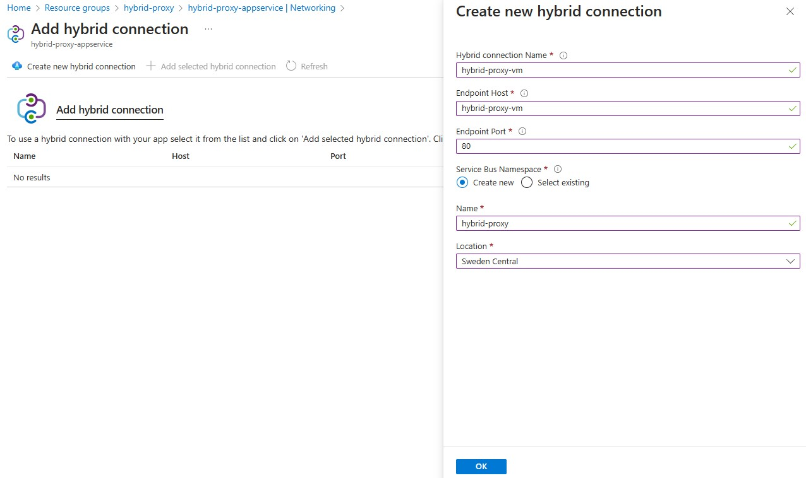
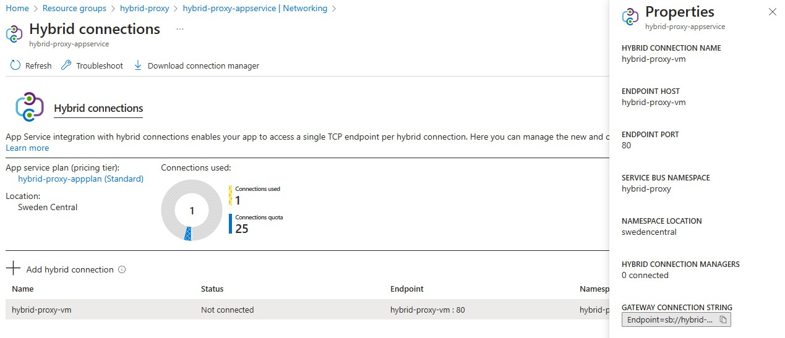
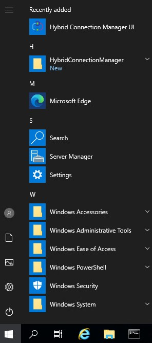
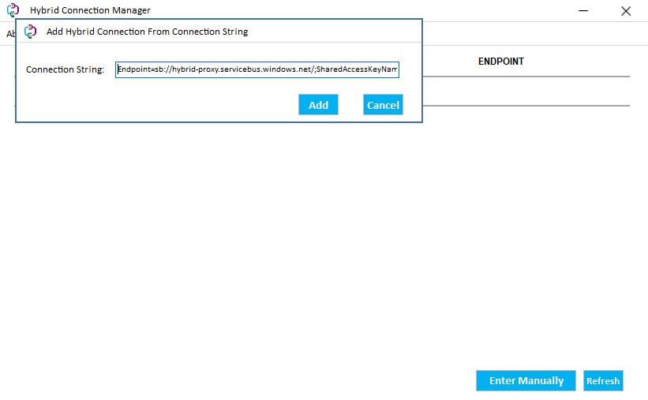
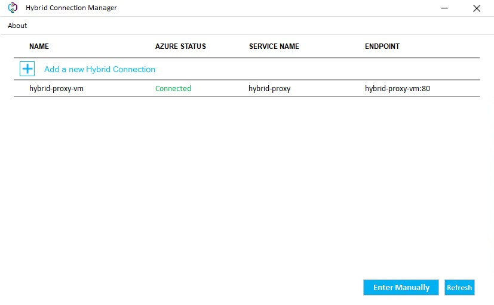

# Azure Hybrid Application Proxy - Scalable reverse proxy solution with flexible identity provider support

The Azure Hybrid Application Proxy project aims to create a highly scalable and flexible reverse proxy solution built on Azure App Service and leveraging Azure App Service Hybrid Connections. The key objectives are:

1. **Massive Scale**: Overcome the 750 requests per second limit of the current Azure Application Proxy offering to enable massive scale.

2. **Flexible Identity Provider Support**: Extend identity provider support beyond Azure Active Directory to also integrate with Azure AD B2C and potentially other IDPs in the future. This will allow applications to authenticate users from various identity sources.

3. **Azure App Service Foundation**: Utilize Azure App Service as the core hosting platform to gain benefits such as auto-scaling, high availability, and managed runtimes.

4. **Secure Hybrid Connectivity**: Implement Azure App Service Hybrid Connections to securely connect the proxy to on-premises web applications without requiring opening inbound ports on the firewall.

5. **Pure Reverse Proxy**: Act as a pure reverse proxy solution, securely relaying authenticated requests to backend applications. The proxy itself will not implement any application logic.

6. **NGINX-based Ingress Controller**: Utilize the well-known Ingress Controller based on NGINX to handle incoming traffic, load balancing, and routing requests to the appropriate backend services.

The solution uses nginx-container-proxy: https://github.com/MariuszFerdyn/nginx-container-proxy

# Deploy Azure App Service
```
#!/bin/bash
##az login #--use-device-code

# Define variables
subscriptionId="your-subscription-id"
webAppName="hybrid-proxy"
resourceGroupName="${webAppName}-rg"
appServicePlan="${webAppName}plan"
containerImage="docker.io/mafamafa/nginx-container-proxy:202502051357"
SKU="B1"
location="your-desired-location"

# Set the active subscription
az account set --subscription "$subscriptionId"

# Create the resource group
az group create \
  --name "$resourceGroupName" \
  --location "$location"

# Create the App Service plan
az appservice plan create \
  --name "$appServicePlan" \
  --resource-group "$resourceGroupName" \
  --sku "$SKU" \
  --is-linux \
  --location "$location"

# Create the Web App
az webapp create \
  --resource-group "$resourceGroupName" \
  --plan "$appServicePlan" \
  --name "${webAppName}-appservice" \
  --deployment-container-image-name "$containerImage"
```
TODO: Web app listening on 8080 - config need to be fixed.

# Set environment variables for the Web App - this is the destination address
```
az webapp config appsettings set \
  --resource-group "$resourceGroupName" \
  --name "${webAppName}-appservice" \
  --settings \
    DEFAULT_OVERRIDE_HOST=emailmarketing.fast-sms.net \
    DEFAULT_OVERRIDE_PORT=80 \
    DEFAULT_OVERRIDE_PROTOCOL=http \
    DEFAULT_OVERRIDE_IP=93.157.100.46
```
At this moment you can browese the site and it will be proxied to the sample my old site.

# Install the Windows VM for test purpose
```
adminUsername="adminuser"
adminPassword="YourPassword123!"
vmSize="Standard_B2s"
az vm create --resource-group $resourceGroupName \
    --name "${webAppName}-vm" \
    --image Win2019Datacenter \
    --public-ip-sku Standard \
    --admin-username $adminUsername --admin-password $adminPassword --size $vmSize --location $location
```
## Install IIS and Sample Pages on VM
```
az vm extension set \
  --resource-group $resourceGroupName \
  --vm-name "${webAppName}-vm" \
  --name CustomScriptExtension \
  --publisher Microsoft.Compute \
  --version 1.10 \
  --settings '{
    "fileUris": ["https://raw.githubusercontent.com/MariuszFerdyn/azure-multiidp-app-proxy/refs/heads/main/scripts/Install_IIS_and_SamplePages.ps1"],
    "commandToExecute": "powershell -ExecutionPolicy Unrestricted -File Install_IIS_and_SamplePages.ps1"
  }'
```
# Create Hybrid connection
1. Open created App Service
2. Go to Networking
3. Click Hybrid connections
4. Click Create new hybrid connection as follow and click ok:
   
5. Open the newly created connection and copy the Gateway Connection String
   
6. Log in using RDP to the machine and install the agent from: https://go.microsoft.com/fwlink/?linkid=841308 </br>
7. Launch the Hybrid Connection Manager UI</br>
   
8. Click Enter Manually and put the copied Gateway Connection string
   
9. Click refresh it should be connected
   
10. If it is not connected issue in PowerShell ```restart-service HybridConnectionManager```
## Debug
Check if the connection is working using bash in AppService (KUDU) like: https://hybrid-proxy-appservice.scm.azurewebsites.net/DebugConsole.
issue: ```curl http://hybrid-proxy-vm```
the expected output:
```
            <h1>Welcome to IIS Demo Site</h1>
        </div>
        <p>Welcome to our IIS demonstration website. This site showcases various features and capabilities of Internet Information Services (IIS).</p>
        <p>Feel free to explore different sections using the navigation menu above. Each page demonstrates different aspects of web hosting and server capabilities.</p>
```
Issue: ```nslookup hybrid-proxy-vm```
the expected ouput:
```
Name:   hybrid-proxy-vm
Address: 127.0.0.14
```
Note the IP address.
# Correct the environment variables that point to the Hybrid connection
```
az webapp config appsettings set \
  --resource-group "$resourceGroupName" \
  --name "${webAppName}-appservice" \
  --settings \
    DEFAULT_OVERRIDE_HOST=hybrid-proxy-vm \
    DEFAULT_OVERRIDE_PORT=80 \
    DEFAULT_OVERRIDE_PROTOCOL=http \
    DEFAULT_OVERRIDE_IP=hybrid-proxy-vm
```
## Test the connection - browsing your WebApp site
e.g.: https://hybrid-proxy-appservice.azurewebsites.net/

If something is not working, use DEFAULT_OVERRIDE_IP as IP like DEFAULT_OVERRIDE_IP=127.0.0.14.
# Enjoy App Service Features
- SSL Offloading is fully operational.
- Autoscaling for peak performance is live.
- Flexible Identity Provider Support: Simply authenticate against Entra ID and many other identity providers.
- Even publish the site on the internet from your laptop.
# Coming soon
- Version for Container Apps
- WAF from ModSecurity
- Header-based single sign-on must be configured on your own via modification of template files: https://github.com/MariuszFerdyn/nginx-container-proxy/tree/main/config
# Probelms
## Performance

If you see performance problems cosider run multiple containers inside Azure App Service. There is no replica statement, so for each you need to create the App Service Slots and distribute trafic, like here:
```
echo "Creating 7 deployment slots for $webAppName in $resourceGroupName..."

# Create 7 deployment slots
for i in {1..7}
do
  echo "Creating slot${i}..."
  az webapp deployment slot create \
    --name $webAppName \
    --resource-group $resourceGroupName \
    --slot "slot${i}" \
    --configuration-source $webAppName
  

  echo "Slot${i} created successfully"
done

# Calculate percentage per slot (8 slots total including production)
TOTAL_SLOTS=8
PERCENT_PER_SLOT=$((100 / TOTAL_SLOTS))
REMAINING=$((100 - (PERCENT_PER_SLOT * TOTAL_SLOTS)))

# Build a single distribution string with correct syntax (comma-separated with full slot names)
echo "Setting up traffic distribution..."

# Initialize distribution string with non-production slots
DISTRIBUTION=""
for i in {1..7}
do
  # Add comma before subsequent slots
  if [ "$DISTRIBUTION" != "" ]; then
    DISTRIBUTION="$DISTRIBUTION,"
  fi
  
  # Use full slot name: webAppName-slotN
  FULL_SLOT_NAME="${webAppName}-slot${i}"
  DISTRIBUTION="${DISTRIBUTION}${FULL_SLOT_NAME}=${PERCENT_PER_SLOT}"
done

echo "Setting traffic distribution: $DISTRIBUTION"
echo "Note: Remaining traffic (${REMAINING}%) will automatically go to the production slot"

# Configure traffic routing with a single command
# Any unallocated percentage automatically goes to production
az webapp traffic-routing set \
  --name $webAppName \
  --resource-group $resourceGroupName \
  --distribution "$DISTRIBUTION"

echo "Traffic splitting has been configured successfully!"
echo "Each slot (including production) receives approximately $PERCENT_PER_SLOT% of traffic."
echo "You can monitor traffic in the Azure Portal under App Service > Deployment Slots > Traffic %"

# Show the current distribution
echo "Current traffic distribution:"
az webapp traffic-routing show \
  --name $webAppName \
  --resource-group $resourceGroupName
```
