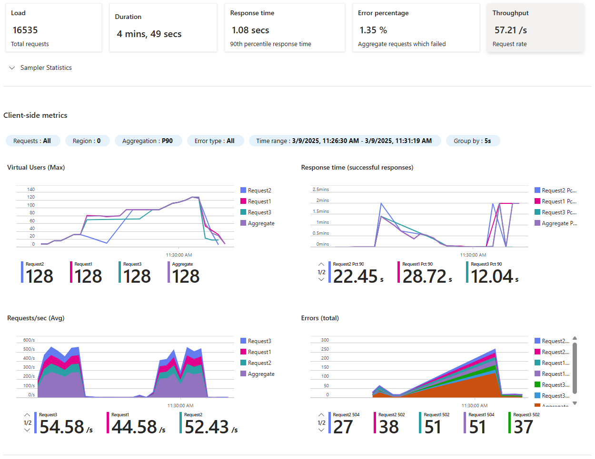
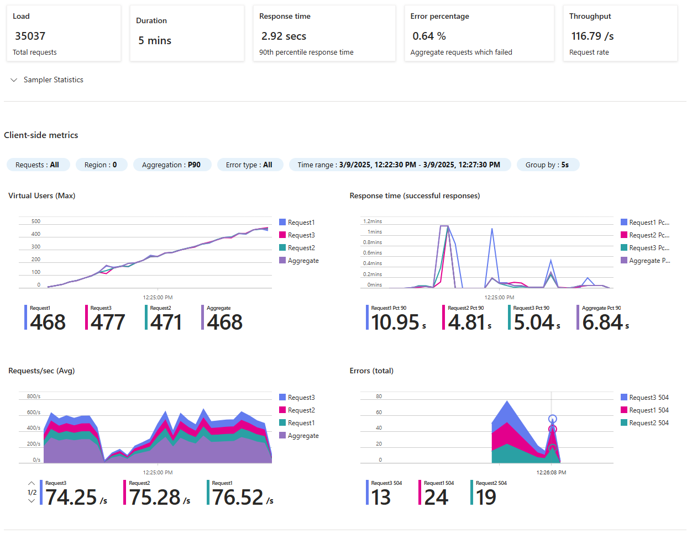
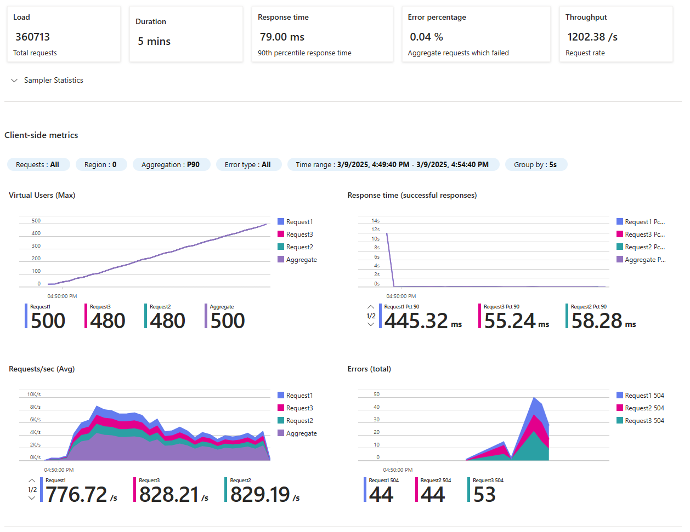
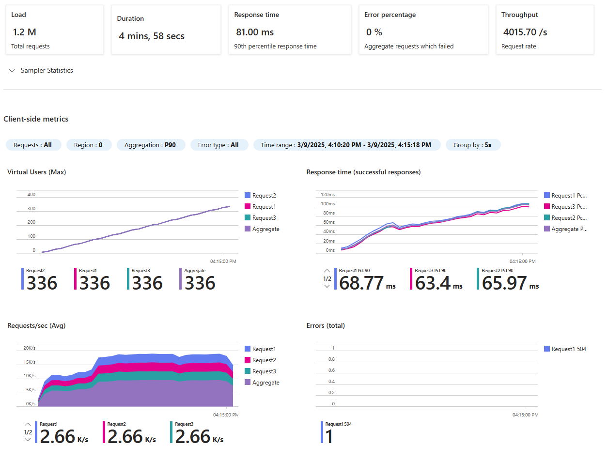

# Azure Performance Testing Results

## App Service Configuration

We tested a single instance of App Service (Premium v3 P1mv3) with 160 concurrent users (20 users × 8 instances) continuously browsing the site.



## Container Apps Configuration 1: Standard Setup

We tested Container Apps with 500 concurrent users (50 users × 10 instances) continuously browsing the site.

```
┌─────────────────────┐    ┌─────────────────────────┐    ┌─────────────┐    ┌────────────┐
│ Container App       │    │ Container App           │    │             │    │            │
│                     │───>│ with azbridge           │───>│ Service Bus │───>│ WebServer  │
│ (2 vCPU / 4GB RAM)  │    │ (2 vCPU / 4GB RAM)      │    │             │    │            │
└─────────────────────┘    └─────────────────────────┘    └─────────────┘    └────────────┘
```

**Note:** This configuration can scale to zero, making it potentially free. There is also a free tier available.



## Container Apps Configuration 2: With Autoscaling

We tested Container Apps with autoscaling enabled and 500 concurrent users (50 users × 10 instances) continuously browsing the site.

```
┌─────────────────────────┐    ┌─────────────────────────┐    ┌─────────────┐    ┌────────────┐
│ Container App           │    │ Container App           │    │             │    │            │
│                         │───>│ with azbridge           │───>│ Service Bus │───>│ WebServer  │
│ (2 vCPU / 4GB RAM)      │    │ (2 vCPU / 4GB RAM)      │    │             │    │            │
│ [autoscaling: 0-15]     │    │                         │    │             │    │            │
└─────────────────────────┘    └─────────────────────────┘    └─────────────┘    └────────────┘
```



## Container Apps Configuration 3: Direct Azbridge (Best Performance)

For the best performance, you can reconfigure the Ingress controller to External and HTTPS for the azbridge container and route traffic directly to your web app.

```
┌─────────────────────────┐    ┌─────────────┐    ┌────────────┐
│ Container App           │    │             │    │            │
│ with azbridge           │───>│ Service Bus │───>│ WebServer  │
│ (2 vCPU / 4GB RAM)      │    │             │    │            │
└─────────────────────────┘    └─────────────┘    └────────────┘
```

This configuration provides the best performance - **4266 requests/s per container**, compared to Azure App Proxy's 750 per tenant!

**Security Recommendation:** For additional security with this configuration, it is highly recommended to add Azure Front Door or Azure App Gateway.

